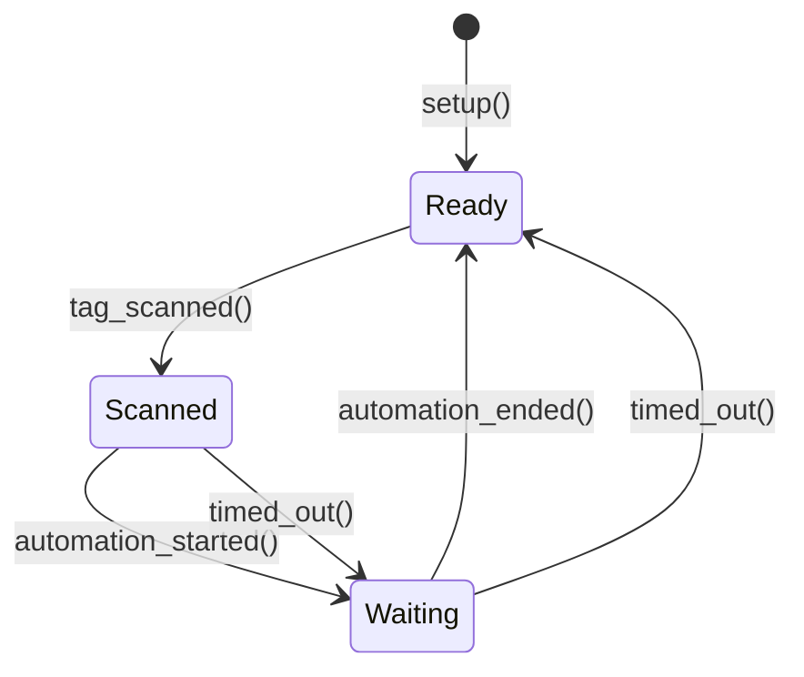

## State Diagram

```mermaid
stateDiagram-v2
    [*] --> Ready : setup()
    Ready --> Scanned : tag_scanned()
    Scanned --> Waiting : automation_started()
    Scanned --> Waiting : timed_out()
    Waiting --> Ready : automation_ended()
    Waiting --> Ready : timed_out()
```
